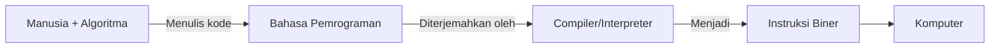

# Bab 1: Dasar Algoritma dan Pemrograman

## 1. Fondasi Koding: Algoritma Pemrograman

Sebelum kita menulis kode, kita harus tahu apa yang ingin kita perintahkan kepada komputer. Di sinilah peran algoritma.

### Pengertian
> [!NOTE] Apa itu Algoritma?
> Algoritma adalah serangkaian **langkah-langkah logis dan sistematis** yang disusun untuk menyelesaikan suatu masalah atau mencapai tujuan tertentu.

Singkatnya, algoritma adalah **resep** untuk memecahkan masalah.

### Manfaat Algoritma
- **Efisiensi:** Membantu menemukan cara tercepat dan terbaik untuk menyelesaikan masalah.
- **Solusi Terstruktur:** Membuat alur program menjadi jelas, teratur, dan mudah dipahami.
- **Mudah Dilacak (Debugging):** Jika terjadi kesalahan, kita bisa melacaknya langkah demi langkah.

### Contoh Nyata Penerapan Algoritma
- **Resep Masakan:** Daftar bahan dan urutan langkah memasak adalah sebuah algoritma. Jika urutannya salah, hasilnya bisa gagal.
- **Petunjuk Arah Google Maps:** Google Maps menggunakan algoritma kompleks untuk menghitung rute tercepat dari lokasimu ke tujuan, dengan mempertimbangkan macet, jarak dan kondisi jalan.
- **Proses Login:** Saat Anda login ke media sosial, sistem menjalankan algoritma: 1. Ambil username & password. 2. Cocokkan dengan database. 3. Jika cocok, izinkan masuk. 4. Jika tidak, tampilkan pesan error.

---

## 2. Apa Itu Bahasa Pemrograman?

### Definisi
> [!NOTE] Apa itu bahasa pemrograman?
> Bahasa pemrograman adalah bahasa buatan yang digunakan untuk **menerjemahkan logika algoritma** ke dalam instruksi yang dapat dijalankan oleh komputer.

### Fungsi
- Mengkomunikasikan perintah manusia ke komputer.    
- Membuat aplikasi, website, game, atau sistem lainnya.
- Mengatur alur logika dan perhitungan yang dilakukan komputer.

### Jenis Bahasa Pemrograman
- **Tingkat Tinggi**: Python, Java, C#, PHP → lebih mudah dipahami manusia.    
- **Tingkat Rendah**: Assembly, C → lebih dekat ke mesin.

---
## 3. Pengenalan Bahasa Pemrograman Populer

Berikut adalah tiga bahasa yang sangat populer di dunia pengembangan web dan AI.

### a. JavaScript (JS)
- **Deskripsi:** Bahasa "wajib" untuk pengembangan web. Awalnya hanya berjalan di browser (frontend) untuk membuat halaman web interaktif, kini juga bisa berjalan di server (backend) dengan Node.js.
- **Digunakan untuk:** Animasi tombol, validasi form, menampilkan pop-up, memuat data tanpa me-refresh halaman, dan hampir semua interaksi di sisi pengguna.

### b. PHP (Hypertext Preprocessor)
- **Deskripsi:** Salah satu bahasa "legendaris" untuk sisi server (backend). Dibuat khusus untuk web, sehingga sangat mudah diintegrasikan dengan HTML.
- **Digunakan untuk:** Mengelola data dari database, memproses input form, membuat halaman login, dan membangun situs web dinamis seperti WordPress.

### c. Python
- **Deskripsi:** Bahasa serbaguna yang terkenal karena sintaksnya yang bersih dan mudah dibaca. Populer di berbagai bidang, tidak hanya web.
- **Digunakan untuk:** Pengembangan web (backend), analisis data, kecerdasan buatan (AI), machine learning, dan otomatisasi tugas.

---

## 4. Komputer dan Manusia via Bahasa Pemrograman

### Permasalahan
Komputer hanya mengerti **bilangan biner (0 dan 1)**, sedangkan manusia berpikir menggunakan **algoritma** dan bahasa alami.
### Solusi
Bahasa pemrograman menjadi **jembatan komunikasi**:

---

## 5. Rangkuman

1. **Algoritma** adalah resep atau urutan langkah logis untuk menyelesaikan masalah.
2. Bahasa pemrograman adalah alat untuk menerjemahkan algoritma ke dalam instruksi komputer.
3. **JavaScript** fokus pada interaktivitas di browser, **PHP** kuat di sisi server untuk web, dan **Python** adalah bahasa serbaguna yang populer di AI dan web.

---

## 6. Latihan

### a. Teori

Pilih jawaban yang paling tepat!
1. Urutan langkah-langkah logis untuk menyelesaikan masalah disebut …
    a. Program
    **b. Algoritma**
    c. Variabel
    d. Server
2. Bahasa pemrograman yang umumnya digunakan untuk membuat interaksi di sisi client (browser) adalah...
    a. PHP
    b. Python
    **c. JavaScript**
    d. Assembly
3. Peran compiler atau interpreter adalah …  
    a. Menyimpan file ke dalam database  
    **b. Menterjemahkan kode program ke bahasa mesin**  
    c. Mengatur layout halaman web  
    d. Menyusun diagram alur program

### b. Praktek

Jawab Soal uraian dibawah ini sesuai dengan pemahaman mu!
4. Buatlah sebuah algoritma sederhana untuk "menghitung total belanjaan di kasir"!

> [!INFO] Catatan untuk Guru
> Kunci jawaban dan rubrik penilaian untuk soal ini dapat dilihat di [[03_Teaching/03_Asesmen/Rubrik_Penilaian/Asesmen_Dasar_Algoritma_dan_Pemrograman]]
