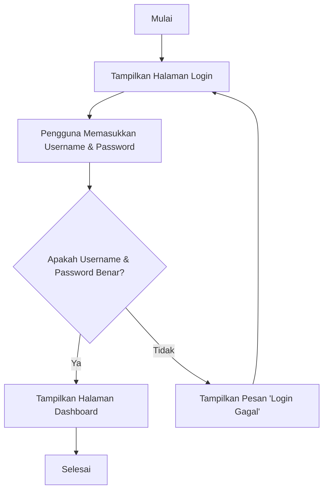

---
tags:
  - pemrograman
  - web
  - flowchart
  - pseudocode
  - PPLG
  - kelas-x
  - modul-ajar
creation-date: 2025-09-08
author: Japar, dan Gemini
publish: false
---
# Modul Ajar - Bab 3: Studi Kasus Flowchart & Pseudocode dalam Konteks Web

> [!INFO]
> **Topik Utama:** Penguatan Flowchart & Pseudocode, Penerapan dalam Logika Web.
> **Tujuan:** Setelah mempelajari modul ini, siswa diharapkan mampu merancang alur logika untuk fitur web sederhana menggunakan flowchart dan pseudocode, sebagai persiapan sebelum masuk ke implementasi kode (HTML, CSS, JS).

---

## 1. Penguatan Konsep: Dari Ide ke Rencana

Di bab sebelumnya, kita telah belajar tentang **Logika & Algoritma** menggunakan `Flowchart` dan `Pseudocode`. Mari kita ingat kembali peran keduanya:

*   **Flowchart (Diagram Alir):** Peta visual dari alur program. Sangat baik untuk melihat gambaran besar dan alur pengambilan keputusan.
*   **Pseudocode:** Resep atau draf program dalam bahasa yang mirip bahasa manusia. Berguna untuk merinci langkah-langkah logika sebelum diubah menjadi bahasa pemrograman sungguhan.

Keduanya adalah **alat perencanaan** yang krusial. Sama seperti arsitek yang membuat denah sebelum membangun rumah, programmer membuat flowchart/pseudocode sebelum menulis kode.

---

## 2. Menjembatani Logika dan Web

Anda mungkin bertanya, "Apa hubungan flowchart dengan membuat website?"

Setiap fitur interaktif di sebuah website—mulai dari tombol "like", form login, hingga keranjang belanja—memiliki **logika** di baliknya. Sebelum kita menulis kode `HTML` untuk strukturnya atau `JavaScript` untuk interaksinya, kita harus merancang logikanya terlebih dahulu.

Mari kita ambil contoh yang sangat umum: **Alur Login Pengguna**.

### Studi Kasus: Alur Login Pengguna

**Masalah:** Kita ingin membuat halaman login. Pengguna memasukkan username dan password. Jika benar, tampilkan halaman dashboard. Jika salah, tampilkan pesan error.

#### a. Desain Logika dengan Flowchart

Kita bisa memvisualisasikan alur tersebut seperti ini:



Dengan flowchart ini, alur program menjadi sangat jelas. Kita tahu ada satu titik keputusan (`if/else`) yang menentukan hasil akhir.

#### b. Merinci Logika dengan Pseudocode

Sekarang, kita ubah flowchart di atas menjadi pseudocode yang lebih detail.

```
START
  PROCEDURE HandleLogin

    READ email_input
    READ password_input

    DEFINE correct_email = "admin@gmail.com"
    DEFINE correct_password = "123"

    IF email_input equals correct_email AND password_input equals correct_password THEN
      DISPLAY "Halaman Dashboard"
    ELSE
      DISPLAY "Pesan Error: Login Gagal!"
    ENDIF

  END PROCEDURE
END
```

Pseudocode ini memberi kita kerangka yang lebih dekat ke kode asli yang akan kita tulis nanti menggunakan JavaScript.

---

## 3. Dari Rencana ke Halaman Web

Flowchart dan pseudocode adalah sebuah rencana logika. Untuk mengimplementasikan rencana tersebut di sebuah halaman web, tiga teknologi utama akan bekerja bersama.

*   **HTML (HyperText Markup Language):** Berperan sebagai fondasi yang membangun **struktur** halaman. Untuk kasus login, HTML digunakan untuk membuat elemen-elemen seperti kolom input untuk username, kolom password, dan sebuah tombol.

*   **CSS (Cascading Style Sheets):** Bertugas untuk menata **tampilan visual**. Setelah struktur dibuat dengan HTML, CSS akan memberikan gaya seperti warna pada tombol, jenis font, dan mengatur tata letak form agar terlihat rapi dan profesional.

*   **JavaScript (JS):** Berfungsi untuk menjalankan **logika interaktif**. JavaScript-lah yang akan mengeksekusi alur dari flowchart/pseudocode. Saat pengguna menekan tombol, JS akan mengambil data input, memvalidasinya sesuai kondisi (`IF...ELSE`), lalu menentukan aksi selanjutnya—apakah menampilkan halaman baru atau memunculkan pesan kesalahan.

Secara singkat: HTML menyusun kerangka, CSS menghias tampilan, dan JavaScript menghidupkan logikanya. Langkah selanjutnya adalah mempelajari cara membangun kerangka tersebut dengan **HTML**.

---

## 4. Latihan Mandiri

**Masalah:** Anda ingin membuat fitur "Dark Mode / Light Mode" pada sebuah website.
*   Jika pengguna mengklik tombol "Toggle Mode".
*   Logikanya harus memeriksa: "Apakah mode saat ini adalah Light Mode?"
*   Jika ya, ubah tampilan menjadi Dark Mode.
*   Jika tidak (berarti sedang Dark Mode), ubah tampilan menjadi Light Mode.

**Tugas Anda:**
1.  Buatlah **flowchart** untuk alur logika fitur "Dark/Light Mode" tersebut.
2.  Tuliskan **pseudocode** yang sesuai dengan flowchart yang telah Anda buat.

---

## 5. Rangkuman

1.  Flowchart dan Pseudocode adalah alat **perencanaan** untuk merancang logika sebelum coding.
2.  Setiap fitur interaktif di web, seperti login, memiliki alur logika yang bisa dirancang dengan flowchart dan pseudocode.
3.  Rencana logika ini nantinya akan diimplementasikan menggunakan **HTML** untuk struktur, **CSS** untuk tampilan, dan **JavaScript** untuk fungsionalitas.
