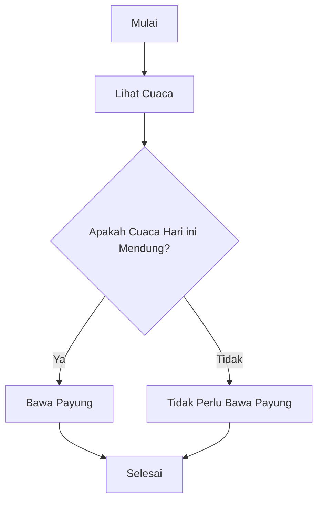
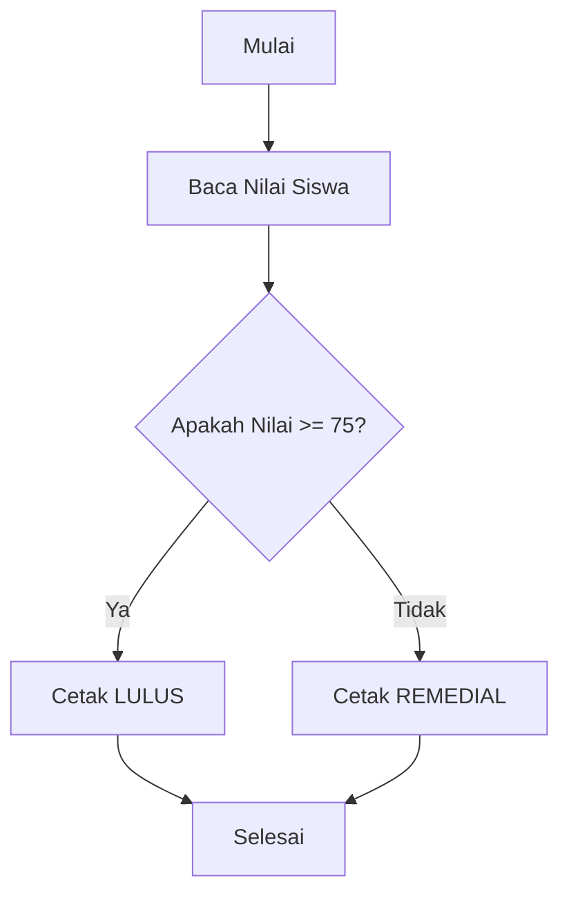

---
tags:
  - pemrograman
  - logika
  - algoritma
  - PPLG
  - kelas-x
  - modul-ajar
creation-date: 2025-09-01
author: Japar, dan Gemini
publish: false
---
# Modul Ajar - Bab 2: Logika & Algoritma Pemrograman

> [!INFO]
> **Topik Utama:** Computational Thinking, Flowchart, dan Pseudocode.
> **Tujuan:** Setelah mempelajari modul ini, siswa diharapkan mampu menjelaskan konsep berpikir komputasional, serta merancang solusi masalah sederhana dalam bentuk flowchart dan pseudocode.

---

## 1. Computational Thinking (CT) / Berpikir Komputasional

**Berpikir komputasional bukanlah berpikir seperti komputer, melainkan sebuah metode pemecahan masalah yang dapat dipahami dan dieksekusi oleh komputer**. Ini adalah fondasi dari semua ilmu komputer dan pemrograman.
CT memiliki 4 pilar utama:
#### a. Dekomposisi (Decomposition)
> [!NOTE]
> Memecah masalah yang kompleks menjadi bagian-bagian yang lebih kecil dan lebih mudah dikelola.

**Contoh:** Masalah "Membuat sepeda" dipecah menjadi: membuat rangka, memasang roda, memasang setang, memasang sistem gir, dll.

#### b. Pengenalan Pola (Pattern Recognition)
> [!NOTE]
> Mencari kesamaan atau pola di antara bagian-bagian masalah yang telah dipecah.

**Contoh:** Saat membuat roda depan dan roda belakang, kita mengenali pola bahwa keduanya membutuhkan pelek, ban, dan jeruji. Proses pembuatannya pun serupa.

#### c. Abstraksi (Abstraction)
> [!NOTE]
> Fokus pada informasi yang penting saja dan mengabaikan detail yang tidak relevan.

**Contoh:** Saat mengendarai motor, kita hanya perlu tahu cara menggunakan gas, rem, dan setang. Kita tidak perlu tahu setiap detail cara kerja mesin pembakaran internalnya. Itulah abstraksi.

#### d. Desain Algoritma (Algorithm Design)
> [!NOTE]
> Mengembangkan solusi langkah-demi-langkah (algoritma) untuk setiap bagian masalah yang lebih kecil.

**Contoh:** Algoritma untuk "memasak mie instan":
1.  Ambil panci.
2.  Panci di isi air keran/minum.
3.  panci di simpan di atas kompor (yang ada di dapur)
4.  nyalakan kompor
5. tungguin sampai mendidih
6. setelah mendidih, masukan mie ke dalam panci
7. tunggu sampai matang mie-nya
8. matikan kompor ketika mie sudah matang
9. ambil mangkok & sendok
10. gunting bumbu mie, lalu tuangkan ke dalam mangkok
11. masukkan mie yang mateng tadi ke mangkok.
12. aduk mie agar bumbu merata
13. kasih cabe (opsional)
14. sudah siap dihidangkan / dimakan / dinikmati / dijual / disantap

---

## 2. Flowchart (Diagram Alir)

Flowchart adalah **representasi visual** dari sebuah algoritma yang menampilkan langkah-langkah dan keputusan untuk melakukan sebuah proses dari suatu program. Setiap langkah digambarkan dalam bentuk diagram dan dihubungkan dengan garis atau arah panah.
#### Fungsi Flowchart

> [!NOTE]
> Fungsi utama dari flowchart adalah memberi gambaran jalannya sebuah program dari satu proses ke proses lainnya. Sehingga, alur program menjadi mudah dipahami oleh semua orang. Selain itu, fungsi lain dari flowchart adalah untuk menyederhanakan rangkaian prosedur agar memudahkan pemahaman terhadap informasi tersebut.


#### Simbol-simbol Dasar Flowchart


#### Contoh Flowchart



---

## 3. Pseudocode

Pseudocode adalah cara menulis algoritma menggunakan bahasa yang sederhana dan informal, yang merupakan jembatan antara bahasa manusia dan bahasa pemrograman. Tidak ada aturan sintaks yang baku, yang terpenting adalah logikanya jelas.

> [!TIP]
> Pseudocode sangat membantu untuk merencanakan logika program sebelum benar-benar menulis kode dalam bahasa pemrograman tertentu (seperti Python, Java, atau C++, dan sebagainya).

#### Contoh Pseudocode

```
START
  READ Cuaca
  IF Cuaca equals "mendung" THEN
    PRINT "Bawa Payung"
  ELSE
    PRINT "Tidak Perlu Bawa Payung"
  ENDIF
END
```

---

## 4. Latihan Interaktif

#### Latihan 1: Berpikir Komputasional di Dunia Nyata
Pikirkan sebuah masalah sehari-hari: **"Merencanakan Liburan Mudik."**
Coba pecahkan masalah tersebut menggunakan 4 pilar Computational Thinking:
1.  **Dekomposisi:** Apa saja tugas-tugas besar yang perlu dipecah? (Contoh: transportasi, akomodasi, destinasi wisata, dll).
2.  **Pengenalan Pola:** Adakah pola atau kesamaan dalam tugas-tugas tersebut? (Contoh: proses booking untuk hotel dan tiket kereta).
3.  **Abstraksi:** Informasi apa yang paling penting? Apa yang bisa diabaikan untuk saat ini?
4.  **Algoritma:** Tuliskan urutan langkah sederhana untuk salah satu tugas, misalnya "memesan tiket kereta".

#### Latihan 2: Membuat Flowchart
Buatlah sebuah flowchart untuk proses berikut:
"Seorang siswa dinyatakan **LULUS** jika nilainya 75 atau lebih, dan **REMEDIAL** jika nilainya di bawah 75."

#### Solusi



#### Latihan 3: Menulis Pseudocode
Dari masalah pada Latihan 2, tuliskan pseudocode yang sesuai!

##### Solusi 

```
START
  READ Nilai

  IF Nilai >= 75 THEN
    PRINT "LULUS"
  ELSE
    PRINT "REMEDIAL"
  ENDIF

END
```

---

## 5. Referensi & Sumber Belajar

Berikut adalah beberapa link untuk memperdalam pemahaman Anda:

*   **Computational Thinking:**
    *   [BBC Bitesize - Introduction to computational thinking](https://www.bbc.co.uk/bitesize/guides/zp92mp3/revision/1) (Penjelasan yang sangat baik dengan contoh-contoh sederhana).
    *   [YouTube - Computational Thinking oleh CS50](https://www.youtube.com/watch?v=6_vS3A4b33k) (Video pengantar dari kursus populer Harvard).

*   **Flowchart & Pseudocode:**
    *   [GeeksforGeeks - Flowcharts](https://www.geeksforgeeks.org/flowcharts/) (Referensi lengkap simbol dan contoh).
    *   [Khan Academy - Intro to Pseudocode](https://www.khanacademy.org/computing/computer-science/algorithms/pseudo-code/a/writing-pseudo-code) (Tutorial penulisan pseudocode).

*   **Alat Interaktif:**
    *   [Mermaid Live Editor](https://mermaid.live/): Tempat untuk berlatih membuat flowchart dengan sintaks Mermaid secara online.
    *   [Draw.io (sekarang diagrams.net)](https://app.diagrams.net/): Alat gratis untuk membuat flowchart dengan cara *drag-and-drop*.