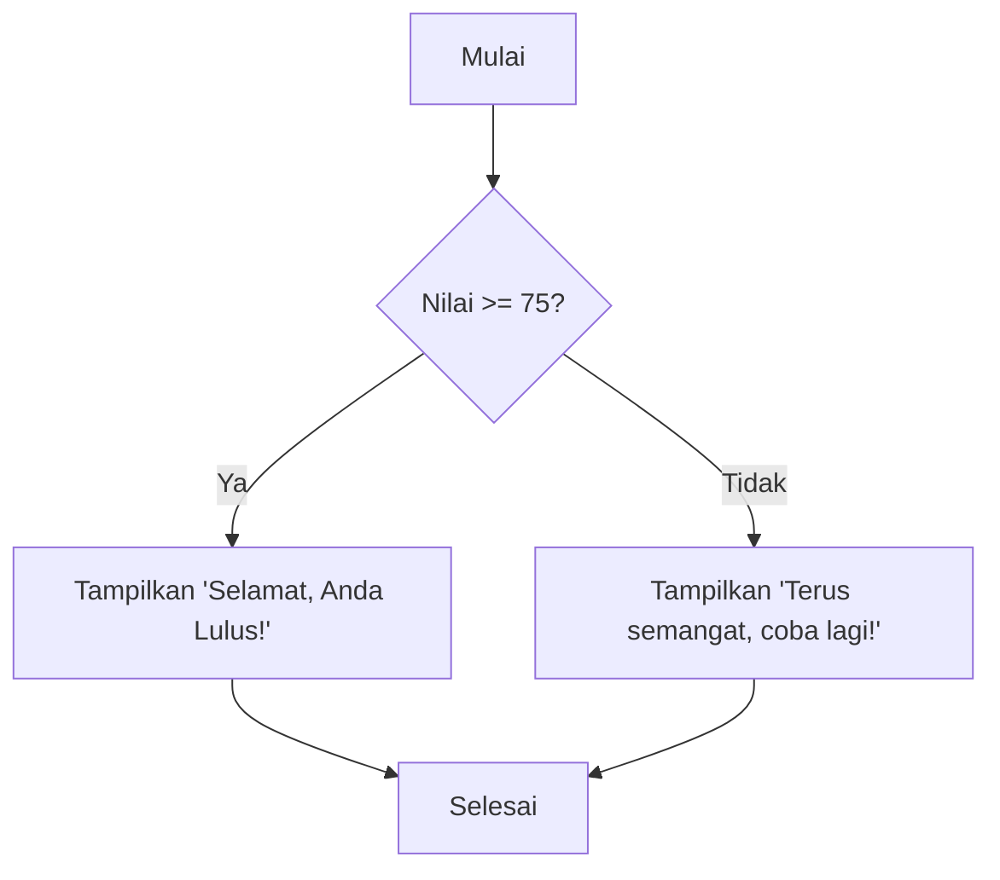

---
tags:
  - koding
  - python
  - fundamental
  - kelas-x
publish: false
---

# 🚀 Memulai Petualangan Koding dengan Python!

Selamat datang di dunia koding! Kalian adalah calon *developer* andal, dan hari ini kita akan memulai perjalanan dengan salah satu bahasa paling populer di dunia: **Python** 🐍.

Anggap saja belajar koding itu seperti belajar resep baru. Kita memberikan serangkaian instruksi (resep) kepada komputer (koki) untuk menghasilkan sesuatu yang kita inginkan (masakan). Python adalah bahasa yang kita gunakan agar si "koki" mengerti perintah kita.

## 1. `print()`: Cara Komputer "Berbicara" 🗣️

Hal pertama yang paling dasar adalah menyuruh komputer menampilkan tulisan. Di Python, kita menggunakan perintah `print()`. Ini seperti kamu menyuruh *smart assistant* di HP-mu untuk menampilkan sesuatu di layar.

**Contoh:**
```python
print("Halo, saya siap belajar koding!")
print("PPLG angkatan 2025, pasti bisa!")
```

**Analogi:**
Pikirkan `print()` seperti tombol "Send" saat kamu *chatting*. Apa pun yang kamu ketik di dalam kurung dan tanda kutip `""` akan "dikirim" dan ditampilkan di layar output.

---

## 2. Variabel: "Kotak Penyimpanan" Data 📦

Saat memasak, kamu butuh wadah untuk menyimpan bahan-bahan seperti gula, garam, atau tepung, kan? Di koding, wadah itu disebut **variabel**. Variabel adalah tempat untuk menyimpan informasi (data) di dalam memori komputer yang bisa kita panggil lagi nanti.

**Contoh:**
```python
# Membuat variabel untuk menyimpan nama dan umur
nama_siswa = "Ahmad"
umur_siswa = 16
sudah_lulus_smp = True # (True berarti 'iya' atau 'benar')

# Menampilkan isi variabel
print("Nama siswa:", nama_siswa)
print("Umur:", umur_siswa)
```

**Analogi Diagram:**
```
+------------------+           +----------------+
|    nama_siswa    | --------> |     "Ahmad"    |  (Menyimpan teks)
+------------------+           +----------------+

+------------------+           +----------------+
|    umur_siswa    | --------> |        16      |  (Menyimpan angka)
+------------------+           +----------------+
```
`nama_siswa` dan `umur_siswa` adalah labelnya, sedangkan `"Ahmad"` dan `16` adalah isi dari kotak penyimpanannya.

---

## 3. Tipe Data: Mengenal Jenis-Jenis Informasi 📝🔢

Setiap informasi yang kita simpan punya jenisnya masing-masing. Sama seperti kamu membedakan antara teks di buku, angka di kalkulator, atau checklist di agenda.

Di Python, tipe data yang paling umum adalah:

*   **String (str)**: Untuk menyimpan teks. Harus diapit tanda kutip `""` atau `''`.
    *   Contoh: `nama = "Budi"`, `asal_sekolah = 'SMPN 1 Jakarta'`
*   **Integer (int)**: Untuk menyimpan bilangan bulat (tanpa koma).
    *   Contoh: `jumlah_siswa = 36`, `tahun_lahir = 2008`
*   **Float (float)**: Untuk menyimpan bilangan desimal (yang ada koma).
    *   Contoh: `nilai_rata_rata = 85.5`, `tinggi_badan = 170.3`
*   **Boolean (bool)**: Hanya punya dua nilai: `True` (benar) atau `False` (salah). Berguna untuk menyatakan sebuah kondisi.
    *   Contoh: `is_active = True`, `is_late = False`

Untuk mengecek tipe data, kita bisa pakai fungsi `type()`:
```python
nilai_matematika = 90
print(type(nilai_matematika))  # Outputnya akan <class 'int'>

berat_badan = 55.8
print(type(berat_badan))     # Outputnya akan <class 'float'>
```

---

## 4. Operator Aritmatika: Matematika ala Komputer ➕➖✖️➗

Komputer sangat andal dalam operasi matematika. Kamu bisa melakukan perhitungan dasar dengan mudah.

*   `+` (Penjumlahan)
*   `-` (Pengurangan)
*   `*` (Perkalian)
*   `/` (Pembagian)
*   `%` (Modulo / Sisa bagi) -> Sangat berguna lho!

**Contoh:**
```python
# Menghitung harga total belanjaan
harga_buku = 25000
jumlah_buku = 3
total_harga = harga_buku * jumlah_buku

print("Total yang harus dibayar: Rp", total_harga)

# Contoh Modulo: Mencari tahu angka ganjil atau genap
angka = 15
sisa_bagi = angka % 2 # 15 dibagi 2 itu 7 sisa 1

print("Sisa bagi dari 15 dibagi 2 adalah:", sisa_bagi) 
# Kalau sisa baginya 0, berarti genap. Kalau 1, berarti ganjil.
```

---

## 5. `if-else`: Membuat Komputer Bisa Mengambil Keputusan 🤔

Dalam hidup, kita sering membuat keputusan berdasarkan kondisi. "Kalau hari ini cerah, aku akan pergi main. Kalau tidak (mendung/hujan), aku di rumah saja."

Komputer juga bisa dilatih untuk membuat keputusan dengan `if`, `elif` (else if), dan `else`.

*   `if`: Cek kondisi pertama. Jika **Benar**, jalankan kodenya.
*   `elif`: Jika kondisi `if` **Salah**, cek kondisi ini.
*   `else`: Jika semua kondisi di atas **Salah**, jalankan kode ini.

**Analogi Diagram Alir (Flowchart):**


**Contoh Kode:**
```python
nilai_akhir = 88

if nilai_akhir >= 85:
  print("Predikat A: Sangat Baik! Pertahankan!")
elif nilai_akhir >= 75:
  print("Predikat B: Sudah Baik, bisa lebih lagi!")
else:
  print("Predikat C: Tetap semangat belajar ya!")
```
Karena `nilai_akhir` adalah `88`, maka program akan mencetak "Predikat A". Coba ganti nilainya dan lihat apa yang terjadi!

---

Selamat! 🎉 Kamu sudah menyelesaikan langkah pertama menjadi seorang *programmer*. Konsep-konsep ini adalah fondasi dari semua program hebat yang ada di dunia. Terus berlatih, jangan takut mencoba dan berbuat salah, karena dari situlah kita belajar paling banyak.

**Selanjutnya, kita akan belajar tentang perulangan (loops) agar komputer bisa melakukan pekerjaan berulang secara otomatis!** Semangat! 💪
