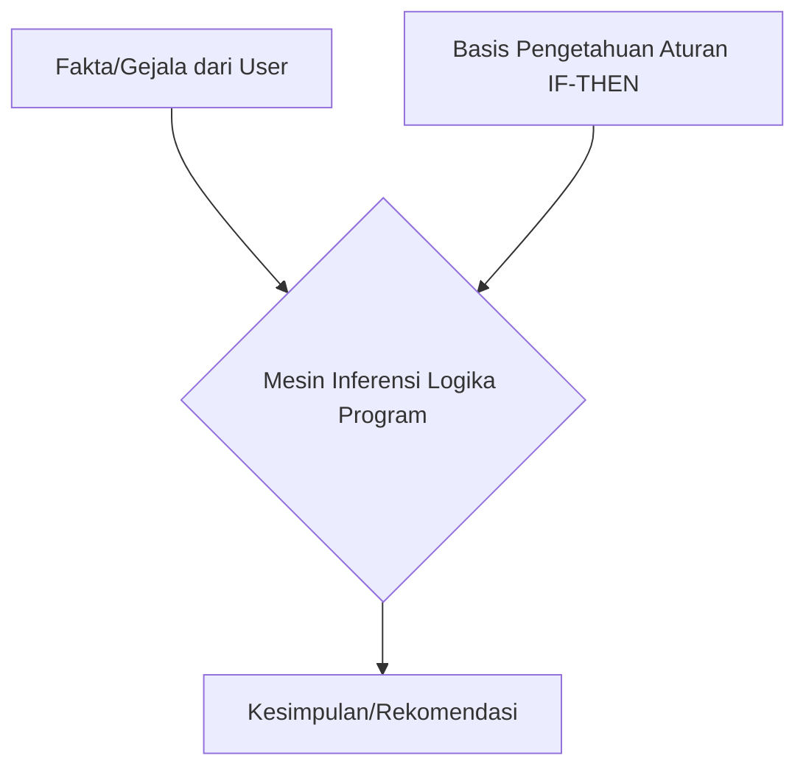

# Bab 2: Membangun Program AI Sederhana - Sistem Pakar

> [!INFO]
> **Tujuan Bab Ini:** Setelah mempelajari bab ini, siswa diharapkan mampu:
> 1.  Memahami konsep Sistem Pakar (Expert System) sebagai bentuk AI berbasis aturan.
> 2.  Menggunakan `fungsi` untuk mengorganisir kode Python.
> 3.  Membuat program interaktif yang menerima input dari pengguna.
> 4.  Membangun sebuah sistem pakar sederhana dari awal menggunakan logika percabangan.

---

## 1. Review Singkat & Jembatan ke Bab 2

Di Bab 1, kita sudah tahu bahwa:
-   AI adalah sistem yang meniru kecerdasan manusia.
-   Python adalah bahasa pilihan untuk AI.
-   Kita sudah bisa menggunakan `variabel`, `if-else`, dan `for loop`.

Sekarang, pertanyaannya: **"Bagaimana cara kita menggabungkan potongan-potongan itu untuk membuat program yang terasa 'cerdas'?"**

Jawabannya adalah dengan memulai dari bentuk AI yang paling dasar dan logis: **Sistem Pakar (Expert System)**.

## 2. Apa Itu Sistem Pakar (Rule-Based AI)?

> [!NOTE] Definisi Sistem Pakar
> Sistem Pakar adalah program komputer yang meniru kemampuan pengambilan keputusan seorang ahli (pakar) di bidang tertentu. Kecerdasannya berasal dari **sekumpulan aturan "JIKA-MAKA" (IF-THEN)** yang ditanamkan oleh pembuatnya.

Ini adalah salah satu bentuk AI pertama dan paling sederhana, sering disebut juga **AI Simbolik** atau *Good Old-Fashioned AI (GOFAI)*.

**Analogi:** Bayangkan seorang dokter mendiagnosis penyakit flu.
-   **Aturan 1:** JIKA pasien `demam` DAN `sakit kepala`, MAKA kemungkinan dia `sakit`.
-   **Aturan 2:** JIKA pasien `sakit` DAN `hidung tersumbat`, MAKA kemungkinan dia terkena `flu`.

Sistem pakar bekerja dengan cara yang sama, mengikuti alur logika dari aturan-aturan yang sudah didefinisikan.



## 3. Alat Baru di Python: Fungsi dan Input

Untuk membangun sistem pakar, kita butuh dua alat baru di Python.

### a. Fungsi (`def`)
Fungsi adalah blok kode yang diberi nama, bisa dipanggil berulang kali, dan bertugas untuk melakukan satu pekerjaan spesifik. Ini membuat kode kita lebih **rapi, terorganisir, dan tidak berulang (DRY - Don't Repeat Yourself)**.

```python
# Mendefinisikan sebuah fungsi bernama 'sapa'
def sapa(nama):
  print(f"Halo, {nama}! Selamat datang di program.")

# Memanggil fungsi
sapa("Andi")
sapa("Citra")
```

### b. Menerima Input dari Pengguna (`input()`)
Untuk membuat program kita interaktif, kita perlu cara untuk bertanya kepada pengguna. Fungsi `input()` digunakan untuk menampilkan sebuah pertanyaan dan menangkap jawaban yang diketik oleh pengguna.

```python
print("Siapa namamu?")
nama_pengguna = input() # Program akan berhenti di sini menunggu user mengetik
print(f"Senang bertemu denganmu, {nama_pengguna}!")

# Versi lebih singkat
hobi = input("Apa hobimu? ")
print(f"Wow, {hobi} itu hobi yang keren!")
```

> [!WARNING] Penting!
> Fungsi `input()` selalu menghasilkan data bertipe **string (teks)**. Jika Anda butuh angka, Anda harus mengubahnya secara manual menggunakan `int()` atau `float()`.

---

## 4. Studi Kasus: Sistem Pakar Penentu Minat & Bakat

Mari kita buat program yang bisa memberikan rekomendasi bidang pekerjaan berdasarkan jawaban pengguna. 

**Nama File: `sistem_pakar.py`**

### Langkah 1: Definisikan Aturan (Basis Pengetahuan)
-   **Aturan 1:** Jika suka `logika` dan `memecahkan masalah` -> Rekomendasi: **Programmer**. 
-   **Aturan 2:** Jika suka `seni` dan `visual` -> Rekomendasi: **Desainer Grafis**.
-   **Aturan 3:** Jika suka `berkomunikasi` dan `bekerja dengan orang` -> Rekomendasi: **Manajer Proyek**.
-   **Lainnya:** Rekomendasi: **Wirausaha**.

### Langkah 2: Tulis Kodenya!

Kita akan gabungkan `fungsi`, `input()`, dan `if-elif-else`.

```python
# sistem_pakar.py

def mulai_sistem_pakar():
    """Fungsi utama untuk menjalankan sistem pakar."""
    print("--- Sistem Pakar Penentu Minat & Bakat ---")
    print("Jawab pertanyaan berikut dengan 'ya' atau 'tidak'.")

    # Mengajukan pertanyaan dan menerima input
    suka_logika = input("Apakah kamu suka dengan logika dan angka? (ya/tidak) ")
    suka_seni = input("Apakah kamu suka menggambar atau hal-hal visual? (ya/tidak) ")
    suka_komunikasi = input("Apakah kamu suka berbicara dan mengatur tim? (ya/tidak) ")

    # Proses pengambilan keputusan (Mesin Inferensi)
    if suka_logika == 'ya':
        rekomendasi = "Programmer / Software Developer"
    elif suka_seni == 'ya':
        rekomendasi = "Desainer Grafis / UI/UX Designer"
    elif suka_komunikasi == 'ya':
        rekomendasi = "Manajer Proyek / Product Manager"
    else:
        rekomendasi = "Wirausaha / Entrepreneur"

    # Menampilkan hasil
    print("--- Hasil Rekomendasi ---")
    print(f"Berdasarkan jawabanmu, bidang yang mungkin cocok untukmu adalah: {rekomendasi}")

# Memulai program dengan memanggil fungsi utama
if __name__ == "__main__":
    mulai_sistem_pakar()

```

### Langkah 3: Jalankan dan Uji Coba
Simpan kode di atas, lalu jalankan. Coba berbagai kombinasi jawaban (`ya` atau `tidak`) dan lihat bagaimana program memberikan rekomendasi yang berbeda. Anda baru saja membuat sebuah program AI sederhana!

---

## 5. Latihan

### a. Teori

1.  Apa komponen utama dari sebuah sistem pakar yang berisi aturan-aturan IF-THEN?
    a. Mesin Inferensi
    b. Basis Pengetahuan (Knowledge Base)
    c. User Interface
    d. Database

2.  Apa tujuan utama dari penggunaan `fungsi` dalam pemrograman Python?
    a. Agar program berjalan lebih cepat.
    b. Untuk menyimpan data dalam jumlah besar.
    c. Untuk mengorganisir kode agar rapi, tidak berulang, dan mudah dipanggil kembali.
    d. Untuk mengubah tipe data dari string ke integer.

### b. Praktek

3.  **Tugas Koding:** Modifikasi program `sistem_pakar.py` di atas.
    -   Tambahkan satu pertanyaan baru, misalnya: 
    ```python
    suka_menulis = input("Apakah kamu suka menulis cerita atau artikel? (ya/tidak) ")
    ```
    -   Tambahkan satu `elif` baru untuk menangani jika pengguna menjawab 'ya' pada pertanyaan tersebut, dengan rekomendasi misalnya: `"Penulis Konten / Jurnalis"`.
    -   Uji coba kembali program Anda.
