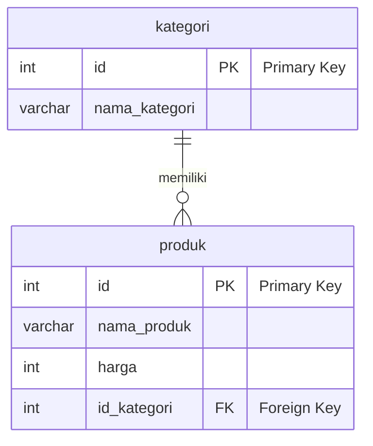

# Modul Ajar: Fondasi Database Relasional (SQL)

> [!INFO]
> **Topik Utama:** Jenis-jenis Relasi Database, Foreign Key, dan Perintah `JOIN`.
> **Tujuan:** Setelah mempelajari modul ini, siswa diharapkan mampu merancang struktur database relasional sederhana dan menggabungkan data dari beberapa tabel menggunakan perintah `JOIN` untuk menampilkan informasi yang lebih lengkap dan bermakna.

---

## 1. Tinjauan Ulang: Kenapa Data Harus Dipisah?

Di dunia nyata, menyimpan semua data dalam satu tabel raksasa adalah ide yang buruk. Data menjadi berulang (redundan), tidak efisien, dan sulit dikelola. Sebagai gantinya, kita memecah data ke dalam tabel-tabel logis yang lebih kecil.

**Contoh:** Daripada satu tabel besar, kita punya:
-   Tabel `siswa` (berisi data siswa)
-   Tabel `kelas` (berisi data kelas)
-   Tabel `ekstrakurikuler` (berisi data ekskul)

**Masalahnya:** Bagaimana cara tabel-tabel ini "berbicara" satu sama lain? Jawabannya adalah dengan **Relasi**.

---

## 2. Konsep Kunci: Primary Key & Foreign Key

Relasi dibangun di atas dua konsep fundamental:

-   **Primary Key (PK):** Sebuah kolom yang menjadi **identitas unik** untuk setiap baris di dalam tabel itu sendiri. Contoh: `id` di tabel `siswa` atau `id_kelas` di tabel `kelas`.
-   **Foreign Key (FK):** Sebuah kolom di satu tabel yang nilainya **merujuk ke Primary Key** di tabel lain. Inilah yang berfungsi sebagai "benang penghubung" antar tabel.



### Cara Membuat Foreign Key di SQL

Foreign Key didefinisikan saat kita membuat atau mengubah tabel. Sintaks dasarnya adalah sebagai berikut:

**Saat Membuat Tabel Baru (`CREATE TABLE`):**

```sql
CREATE TABLE nama_tabel (
    id INT PRIMARY KEY,
    -- kolom-kolom lain
    id_tabel_lain INT,
    FOREIGN KEY (id_tabel_lain) REFERENCES tabel_lain(id)
);
```

**Contoh Praktis:**

Misalkan kita punya tabel `kategori` dan kita ingin membuat tabel `produk` yang terhubung ke `kategori`.

```sql
-- Tabel "One" untuk menyimpan kategori produk
CREATE TABLE category (
	id INT AUTO_INCREMENT PRIMARY KEY,
	name VARCHAR(50) NOT NULL
);

ALTER TABLE products 
ADD COLUMN category_id INT NULL;

ALTER TABLE products 
ADD CONSTRAINT fk_products_category
FOREIGN KEY (category_id) REFERENCES category(id);

-- Tabel "Many" untuk menyimpan produk, dengan Foreign Key ke kategori
CREATE TABLE products (
    id INT AUTO_INCREMENT PRIMARY KEY,
    name VARCHAR(100) NOT NULL,
    price INT,
    id_kategori INT, -- Kolom ini akan menjadi Foreign Key
    FOREIGN KEY (id_kategori) REFERENCES kategori(id)
);
```
- `FOREIGN KEY (id_kategori)`: Menandakan bahwa kolom `id_kategori` di tabel `produk` adalah sebuah Foreign Key.
- `REFERENCES kategori(id)`: Menentukan bahwa `id_kategori` ini merujuk ke kolom `id` di dalam tabel `kategori`.

**Setelah Tabel Dibuat (`ALTER TABLE`):**

Jika tabel sudah terlanjur dibuat tanpa Foreign Key, kita bisa menambahkannya kemudian menggunakan `ALTER TABLE`.

```sql
ALTER TABLE nama_tabel
ADD CONSTRAINT nama_constraint_fk
FOREIGN KEY (id_tabel_lain) REFERENCES tabel_lain(id);
```
- `ADD CONSTRAINT nama_constraint_fk`: Memberi nama pada Foreign Key. Ini adalah praktik yang baik untuk mempermudah pengelolaan di masa depan (misalnya jika ingin menghapusnya). Nama constraint harus unik di dalam database.

**Contoh Praktis:**

Misalkan tabel `produk` sudah ada, tapi kolom `id_kategori` belum dijadikan Foreign Key.

```sql
ALTER TABLE produk
ADD CONSTRAINT fk_produk_kategori
FOREIGN KEY (id_kategori) REFERENCES kategori(id);
```
Perintah ini akan menambahkan relasi antara tabel `produk` dan `kategori` tanpa harus membuat ulang tabel `produk`.

Dengan adanya `FOREIGN KEY`, database akan memberlakukan aturan:
1.  Anda tidak bisa memasukkan `id_kelas` di tabel `siswa` yang tidak ada di tabel `kelas`.
2.  Anda tidak bisa menghapus sebuah `kelas` jika masih ada `siswa` yang terhubung ke kelas tersebut (kecuali diatur lain).

---

## 3. Tiga Jenis Relasi Database

Ada tiga jenis utama hubungan antar tabel yang perlu kita pahami.

### a. One-to-Many (Satu-ke-Banyak)
Ini adalah relasi yang paling umum. Satu baris di Tabel A bisa terhubung ke **banyak** baris di Tabel B.

-   **Contoh:** Relasi antara `kelas` dan `siswa`.
    -   Satu kelas (misal: "XI PPLG 1") bisa memiliki **banyak siswa**.
    -   Tetapi, satu siswa hanya bisa berada di **satu kelas**.
-   **Implementasi:** Tabel `siswa` (sisi "Many") harus memiliki Foreign Key, misalnya `id_kelas`, yang merujuk ke Primary Key di tabel `kelas` (sisi "One").

### b. Many-to-Many (Banyak-ke-Banyak)
Banyak baris di Tabel A bisa terhubung ke banyak baris di Tabel B.

-   **Contoh:** Relasi antara `siswa` dan `ekstrakurikuler`.
    -   Satu siswa bisa mengikuti **banyak ekskul**.
    -   Satu ekskul bisa diikuti oleh **banyak siswa**.
-   **Implementasi:** Kita tidak bisa langsung menghubungkan keduanya. Kita butuh **tabel perantara** (disebut juga *junction* atau *pivot table*). Misalnya, tabel `pendaftaran_ekskul` yang isinya hanya `id_siswa` dan `id_ekskul`.

### c. One-to-One (Satu-ke-Satu)
Satu baris di Tabel A hanya terhubung ke satu baris di Tabel B. Relasi ini lebih jarang digunakan.

-   **Contoh:** Relasi antara `siswa` dan `detail_siswa`.
    -   Satu siswa hanya punya **satu detail** (misal: NISN, nomor telepon orang tua).
    -   Satu detail hanya dimiliki oleh **satu siswa**.
-   **Implementasi:** Foreign Key bisa ditempatkan di salah satu tabel.

---

## 4. Praktik SQL: Menggabungkan Tabel dengan `JOIN`

`JOIN` adalah perintah SQL untuk mengambil data dari tabel-tabel yang memiliki relasi.

### Studi Kasus 1: Relasi One-to-Many (`produk` dan `kategori`)

**Skenario:** Di sebuah toko online, kita ingin menampilkan daftar produk beserta nama kategorinya. Satu kategori bisa memiliki banyak produk, tetapi satu produk hanya masuk ke dalam satu kategori.

**Struktur Tabel:**

```sql
-- Tabel untuk menyimpan kategori (sisi "One")
CREATE TABLE kategori (
    id INT AUTO_INCREMENT PRIMARY KEY,
    nama_kategori VARCHAR(50) NOT NULL
);

-- Tabel untuk menyimpan produk (sisi "Many")
CREATE TABLE produk (
    id INT AUTO_INCREMENT PRIMARY KEY,
    nama_produk VARCHAR(100) NOT NULL,
    harga INT,
    id_kategori INT, -- Ini adalah Foreign Key
    FOREIGN KEY (id_kategori) REFERENCES kategori(id)
);
```

**Query:**

```sql
SELECT
    produk.nama_produk,
    produk.harga,
    kategori.nama_kategori
FROM produk
INNER JOIN kategori ON produk.id_kategori = kategori.id;
```

- `INNER JOIN kategori`: Perintahkan SQL untuk menggabungkan dengan tabel `kategori`.
- `ON produk.id_kategori = kategori.id`: Beri tahu SQL bahwa "benang penghubung"-nya adalah kolom `id_kategori` di tabel `produk` dan kolom `id` di tabel `kategori`.

**Hasil yang Diharapkan:**

| nama_produk | harga | nama_kategori |
|---|---|---|
| Laptop ABC | 12000000 | Elektronik |
| Buku Tulis | 5000 | Alat Tulis |
| Mouse XYZ | 250000 | Aksesoris Komputer|

Contoh ini memperkuat bagaimana relasi `One-to-Many` digunakan dalam skenario bisnis yang sangat umum.

### Studi Kasus 2: Relasi Many-to-Many (`produk` dan `tag`)

**Skenario:** Menampilkan daftar produk beserta tag yang melekat padanya. Sebuah produk bisa punya banyak tag (misal: "promo", "terlaris"), dan sebuah tag bisa disematkan ke banyak produk.

**Struktur Tabel:**
```sql
-- Tabel master produk
CREATE TABLE produk (
    id INT AUTO_INCREMENT PRIMARY KEY,
    nama_produk VARCHAR(100) NOT NULL
);

-- Tabel master tag
CREATE TABLE tag (
    id INT AUTO_INCREMENT PRIMARY KEY,
    nama_tag VARCHAR(50) NOT NULL
);

-- Tabel perantara (junction table)
CREATE TABLE produk_tag (
    id_produk INT,
    id_tag INT,
    PRIMARY KEY (id_produk, id_tag), -- Primary key gabungan
    FOREIGN KEY (id_produk) REFERENCES produk(id),
    FOREIGN KEY (id_tag) REFERENCES tag(id)
);
```

**Query (Membutuhkan 2x JOIN):**
```sql
SELECT
    produk.nama_produk,
    tag.nama_tag
FROM produk
INNER JOIN produk_tag ON produk.id = produk_tag.id_produk
INNER JOIN tag ON produk_tag.id_tag = tag.id;
```
- **JOIN pertama:** Menghubungkan `produk` dengan tabel perantara `produk_tag`.
- **JOIN kedua:** Menghubungkan hasil dari join pertama dengan tabel `tag`.

---

## 5. Menganalisis Data Gabungan

Setelah data digabung, kita bisa menganalisisnya lebih dalam menggunakan `GROUP BY`, `WHERE`, dan `ORDER BY`.

**Contoh:** Menghitung jumlah produk di setiap kategori dan mengurutkannya dari yang paling banyak.

```sql
SELECT
    kategori.nama_kategori,
    COUNT(produk.id) AS jumlah_produk -- COUNT() untuk menghitung jumlah produk
FROM kategori
INNER JOIN produk ON kategori.id = produk.id_kategori
GROUP BY kategori.nama_kategori -- Kelompokkan hasil berdasarkan nama kategori
ORDER BY jumlah_produk DESC; -- Urutkan dari jumlah produk terbanyak
```

---

## 6. Latihan & Uji Pemahaman

1.  **Teori:** Jelaskan perbedaan mendasar antara relasi *One-to-Many* dan *Many-to-Many*. Kapan kita harus menggunakan tabel perantara (*junction table*)?
2.  **Desain:** Anda diminta merancang database untuk sistem peminjaman buku di perpustakaan. Tentukan tabel-tabel apa saja yang dibutuhkan (minimal 3), jelaskan kolom-kolomnya, dan gambarkan jenis relasi antar tabel tersebut.
3.  **Praktik:** Berdasarkan desain database perpustakaan Anda, tuliskan query SQL untuk menampilkan judul buku yang sedang dipinjam oleh seorang siswa tertentu.