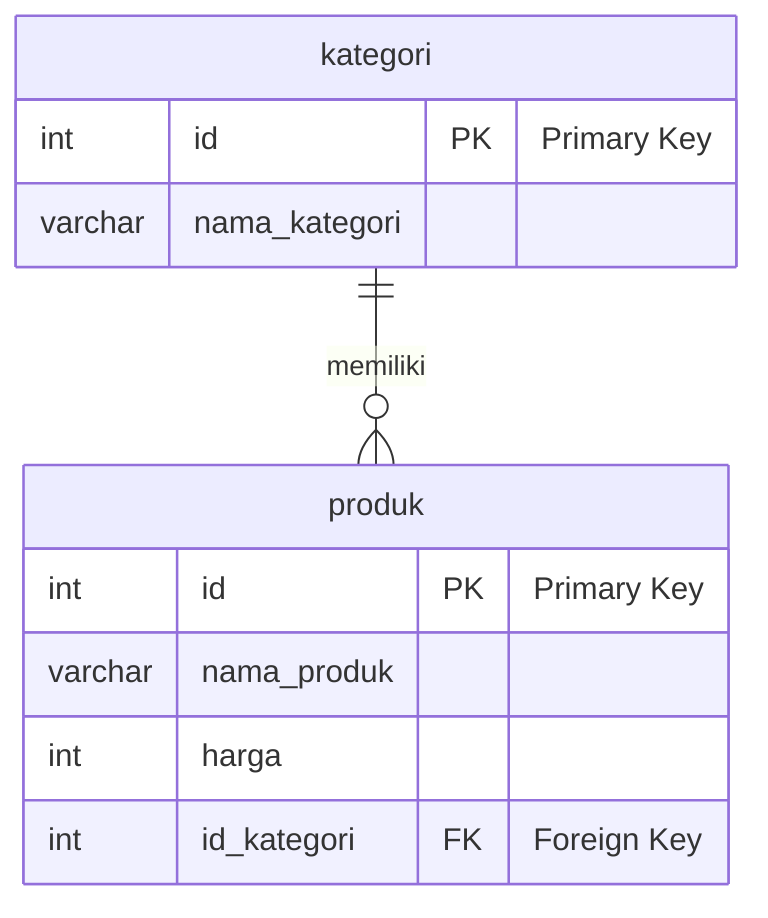

# Modul Teori: Konsep Relasi dan JOIN dalam SQL

> [!INFO]
> **Topik Utama:** Primary Key, Foreign Key, Jenis-jenis Relasi, dan Tipe-Tipe Perintah `JOIN`.
> **Tujuan:** Dokumen ini berfungsi sebagai referensi teoritis untuk memahami konsep-konsep fundamental yang membangun hubungan antar tabel dan cara menggabungkan data dalam database relasional.

---

## 1. Konsep Kunci: Primary Key & Foreign Key

Relasi antar tabel dibangun di atas dua konsep fundamental yang menjamin integritas dan keterhubungan data.

### a. Primary Key (PK)
-   **Definisi:** Sebuah kolom (atau beberapa kolom) yang berfungsi sebagai **identitas unik** untuk setiap baris data dalam sebuah tabel.
-   **Sifat:**
    -   **Tidak Boleh NULL:** Nilainya tidak boleh kosong.
    -   **Harus Unik:** Tidak boleh ada dua baris dengan nilai Primary Key yang sama.
-   **Analogi:** Anggap seperti Nomor Induk Kependudukan (NIK) untuk setiap warga negara. Setiap orang punya satu NIK yang unik dan tidak mungkin sama dengan orang lain.
-   **Contoh:** Kolom `id` pada tabel `siswa`, atau `id_produk` pada tabel `produk`.

### b. Foreign Key (FK)
-   **Definisi:** Sebuah kolom (atau beberapa kolom) di satu tabel yang nilainya **merujuk ke Primary Key** di tabel lain.
-   **Fungsi:** Berperan sebagai "benang penghubung" atau "jembatan" yang menciptakan relasi antar tabel.
-   **Analogi:** Jika tabel `transaksi` memiliki kolom `id_produk`, maka `id_produk` tersebut adalah Foreign Key yang menunjuk ke Primary Key di tabel `produk`. Ini memastikan bahwa setiap transaksi pasti terhubung ke produk yang valid.
-   **Integritas Referensial:** Foreign Key menjaga *referential integrity*, artinya:
    1.  Anda tidak bisa memasukkan nilai Foreign Key yang tidak ada di Primary Key tabel induknya.
    2.  Anda umumnya tidak bisa menghapus data di tabel induk jika data tersebut masih direferensikan oleh Foreign Key di tabel anak (kecuali ada aturan khusus seperti `ON DELETE CASCADE`).

---

## 2. Tiga Jenis Relasi Database

Hubungan antar tabel dapat dikategorikan ke dalam tiga jenis utama.

### a. One-to-Many (Satu-ke-Banyak)
Ini adalah jenis relasi yang paling umum. Satu baris di Tabel A bisa terhubung ke **banyak** baris di Tabel B, tetapi satu baris di Tabel B hanya terhubung ke **satu** baris di Tabel A.

-   **Contoh:** Relasi antara `kategori` dan `produk`.
    -   Satu kategori (misal: "Elektronik") bisa memiliki **banyak produk**.
    -   Tetapi, satu produk (misal: "Laptop ABC") hanya bisa berada di **satu kategori**.
-   **Implementasi:** Tabel pada sisi "Many" (yaitu `produk`) harus memiliki Foreign Key yang merujuk ke Primary Key di tabel sisi "One" (yaitu `kategori`).

### b. Many-to-Many (Banyak-ke-Banyak)
Banyak baris di Tabel A bisa terhubung ke banyak baris di Tabel B, dan sebaliknya.

-   **Contoh:** Relasi antara `produk` dan `tag`.
    -   Satu produk bisa memiliki **banyak tag** (misal: "promo", "terlaris", "baru").
    -   Satu tag (misal: "terlaris") bisa disematkan pada **banyak produk**.
-   **Implementasi:** Relasi ini tidak bisa diimplementasikan secara langsung. Diperlukan sebuah **tabel perantara** (disebut juga *junction table* atau *pivot table*). Tabel ini akan berisi Foreign Key yang merujuk ke Primary Key dari kedua tabel yang dihubungkan. Misalnya, tabel `produk_tag` yang isinya `id_produk` dan `id_tag`.

### c. One-to-One (Satu-ke-Satu)
Satu baris di Tabel A hanya terhubung ke satu baris di Tabel B. Relasi ini lebih jarang digunakan, seringkali untuk memisahkan data yang jarang diakses atau untuk alasan keamanan.

-   **Contoh:** Relasi antara `siswa` dan `detail_kontak_darurat`.
    -   Satu siswa hanya punya **satu set data kontak darurat**.
    -   Satu set data kontak darurat hanya dimiliki oleh **satu siswa**.
-   **Implementasi:** Foreign Key bisa ditempatkan di salah satu tabel, dan biasanya kolom Foreign Key tersebut juga diberi constraint `UNIQUE`.

---

## 3. Memahami Perintah `JOIN`

`JOIN` adalah perintah SQL yang digunakan untuk menggabungkan baris dari dua atau lebih tabel berdasarkan kolom yang berelasi.

### a. `INNER JOIN`
-   **Fungsi:** Mengembalikan baris data yang memiliki nilai yang cocok di **kedua** tabel. Jika ada data di satu tabel yang tidak punya pasangan di tabel lainnya, data tersebut tidak akan ditampilkan.
-   **Analogi:** Seperti mencari irisan (intersection) dalam diagram Venn.
-   **Visualisasi:**
    

### b. `LEFT JOIN` (atau `LEFT OUTER JOIN`)
-   **Fungsi:** Mengembalikan **semua** baris dari tabel kiri (tabel pertama yang disebut), dan baris yang cocok dari tabel kanan. Jika tidak ada kecocokan di tabel kanan, hasilnya akan `NULL` untuk kolom-kolom dari tabel kanan.
-   **Kapan digunakan:** Ketika Anda ingin melihat semua data dari satu tabel utama, terlepas dari apakah data itu punya relasi di tabel lain atau tidak. Contoh: "Tampilkan semua produk, dan jika produk itu pernah terjual, tampilkan juga data penjualannya."
-   **Visualisasi:**
    

### c. `RIGHT JOIN` (atau `RIGHT OUTER JOIN`)
-   **Fungsi:** Kebalikan dari `LEFT JOIN`. Mengembalikan **semua** baris dari tabel kanan (tabel kedua), dan baris yang cocok dari tabel kiri. Jika tidak ada kecocokan, hasilnya `NULL` untuk kolom-kolom dari tabel kiri.
-   **Kapan digunakan:** Jarang digunakan karena biasanya bisa ditulis ulang sebagai `LEFT JOIN` dengan menukar posisi tabel, yang seringkali lebih mudah dibaca.
-   **Visualisasi:**
    

### d. `FULL OUTER JOIN`
-   **Fungsi:** Mengembalikan semua baris ketika ada kecocokan di salah satu tabel (kiri atau kanan). Jika data di tabel kiri tidak punya pasangan di kanan, kolom kanan akan `NULL`. Sebaliknya, jika data di tabel kanan tidak punya pasangan di kiri, kolom kiri akan `NULL`.
-   **Kapan digunakan:** Ketika Anda ingin melihat semua data dari kedua tabel tanpa ada yang hilang.
-   **Visualisasi:**
    
> **Catatan:** MySQL tidak mendukung `FULL OUTER JOIN` secara langsung. Efek yang sama bisa dicapai dengan menggabungkan `LEFT JOIN` dan `RIGHT JOIN` menggunakan `UNION`.

---

## 4. Referensi dan Dokumentasi Resmi

Untuk pemahaman yang lebih mendalam dan detail teknis, selalu rujuk ke dokumentasi resmi dari sistem database yang Anda gunakan.

-   **MySQL:**
    -   [Dokumentasi `JOIN` Syntax](https://dev.mysql.com/doc/refman/8.0/en/join.html)
    -   [Dokumentasi `FOREIGN KEY` Constraints](https://dev.mysql.com/doc/refman/8.0/en/create-table-foreign-keys.html)
-   **PostgreSQL:**
    -   [Dokumentasi `JOIN` (Table Expressions)](https://www.postgresql.org/docs/current/queries-table-expressions.html#QUERIES-FROM)
    -   [Dokumentasi `FOREIGN KEY` Constraints](https://www.postgresql.org/docs/current/ddl-constraints.html#DDL-CONSTRAINTS-FK)
-   **SQL Server:**
    -   [Dokumentasi `JOIN`](https://learn.microsoft.com/en-us/sql/relational-databases/performance/joins?view=sql-server-ver16)
    -   [Dokumentasi `Primary and Foreign Key Constraints`](https://learn.microsoft.com/en-us/sql/relational-databases/tables/primary-and-foreign-key-constraints?view=sql-server-ver16)
