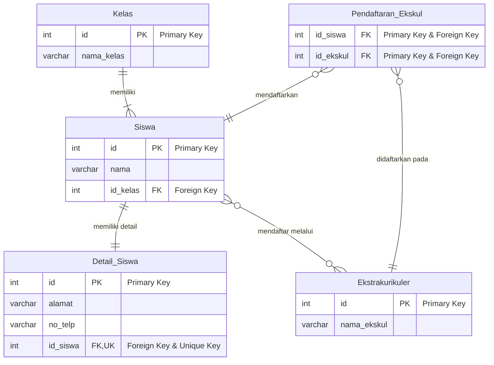

---
tags:
  - database
  - sql
  - mysql
  - relasi-data
  - kelas-xi
  - modul-ajar
creation-date: 2025-10-02
author: Japar, disempurnakan oleh Gemini
publish: false
---
# Modul Ajar: Pendalaman Desain Database Relasional dengan MySQL

> [!INFO]
> **Mata Pelajaran:** Pemrograman Perangkat Lunak dan Gim (PPLG)
> **Kelas:** XI (Sebelas)
> **Topik Utama:** Desain Relasi Lanjutan (`One-to-One`, `Many-to-Many`), `CONSTRAINT`, Aksi Referensial (`ON DELETE`/`ON UPDATE`), dan `JOIN` kompleks.
> **Acuan CP/ATP:** Modul ini selaras dengan elemen pembelajaran **Pengembangan Perangkat Lunak** dan **Analisis Data**, dengan fokus pada perancangan, implementasi, dan pemeliharaan integritas data dalam sistem basis data relasional.

![[Cetak_Biru_Sang_Arsitek.mp4]]
## 1. Tujuan Pembelajaran

Setelah mempelajari modul ini, siswa diharapkan mampu:
1.  Merancang dan mengimplementasikan tiga jenis relasi database utama: `One-to-Many`, `One-to-One`, dan `Many-to-Many`.
2.  Memahami dan menerapkan `CONSTRAINT` untuk menjaga integritas dan validitas data.
3.  Menggunakan aksi referensial (`CASCADE`, `SET NULL`, `RESTRICT`) untuk mengelola data yang saling terhubung.
4.  Menulis query `JOIN` yang kompleks untuk mengambil data dari berbagai tabel yang berelasi.
5.  Membuat diagram ERD (Entity-Relationship Diagram) sederhana.

---

## 2. Tinjauan Ulang: Fondasi Relasi

Pada pertemuan sebelumnya, kita telah membahas relasi paling umum, **One-to-Many**, di mana satu baris data di tabel "induk" bisa terhubung ke banyak baris di tabel "anak". Contohnya, satu `kelas` memiliki banyak `siswa`.

Fondasi dari semua relasi adalah:
-   **Primary Key (PK):** ID unik untuk setiap baris dalam sebuah tabel (contoh: `id` di tabel `kelas`).
-   **Foreign Key (FK):** "Kunci tamu" di tabel anak yang merujuk ke Primary Key di tabel induk, berfungsi sebagai benang penghubung (contoh: `id_kelas` di tabel `siswa`).

Sekarang, kita akan memperdalam pemahaman kita dengan menjelajahi jenis relasi lain dan konsep-konsep yang membuatnya lebih kuat.

---

## 3. Visualisasi Desain: Entity-Relationship Diagram (ERD)

Sebelum menulis kode, seorang arsitek database akan merancang model datanya terlebih dahulu. ERD adalah peta yang menggambarkan tabel-tabel (entitas) dan hubungan (relasi) di antara mereka.

Berikut adalah contoh ERD untuk sistem sekolah sederhana yang akan kita bangun, mencakup semua jenis relasi:


Diagram di atas menunjukkan:
-   **One-to-Many:** Satu `Kelas` memiliki banyak `Siswa`.
-   **One-to-One:** Satu `Siswa` hanya memiliki satu `Detail_Siswa`.
-   **Many-to-Many:** `Siswa` dan `Ekstrakurikuler` dihubungkan oleh tabel perantara `Pendaftaran_Ekskul`.

---

## 4. Pendalaman Jenis Relasi dan Implementasinya

### a. Relasi `One-to-One` (1:1)

-   **Konsep:** Satu baris di tabel A hanya berhubungan dengan **tepat satu** baris di tabel B.
-   **Kapan digunakan?**
    -   Untuk memisahkan data yang jarang diakses (misal: `detail_siswa`).
    -   Untuk data opsional yang tidak semua baris memilikinya.
    -   Untuk alasan keamanan, memisahkan data sensitif.
-   **Implementasi:** Kita menambahkan `FOREIGN KEY` di salah satu tabel, dan yang terpenting, memberinya `UNIQUE CONSTRAINT`.

**Contoh DDL (Data Definition Language):**
```sql
-- Tabel utama
CREATE TABLE siswa (
    id INT AUTO_INCREMENT PRIMARY KEY,
    nama VARCHAR(100) NOT NULL
);

-- Tabel detail yang terhubung 1:1 dengan siswa
CREATE TABLE detail_siswa (
    id INT AUTO_INCREMENT PRIMARY KEY,
    alamat TEXT,
    no_telp VARCHAR(15),
    id_siswa INT NOT NULL UNIQUE, -- UNIQUE adalah kunci implementasi 1:1
    CONSTRAINT fk_detail_ke_siswa
        FOREIGN KEY (id_siswa) REFERENCES siswa(id)
        ON DELETE CASCADE -- Jika siswa dihapus, detailnya ikut terhapus
);
```
> [!IMPORTANT]
> `CONSTRAINT fk_detail_ke_siswa` adalah penamaan eksplisit untuk Foreign Key. Ini adalah praktik terbaik yang memudahkan pengelolaan database di masa depan.

### b. Relasi `Many-to-Many` (M:N)

-   **Konsep:** Banyak baris di tabel A bisa terhubung ke banyak baris di tabel B.
-   **Contoh:** Satu `siswa` bisa ikut banyak `ekstrakurikuler`, dan satu `ekskul` bisa diikuti banyak `siswa`.
-   **Implementasi:** Wajib menggunakan **tabel perantara** (disebut juga *junction table* atau *pivot table*). Tabel ini minimal berisi dua Foreign Key yang merujuk ke kedua tabel utama.

**Contoh DDL:**
```sql
-- Tabel master ekstrakurikuler
CREATE TABLE ekstrakurikuler (
    id INT AUTO_INCREMENT PRIMARY KEY,
    nama_ekskul VARCHAR(50) NOT NULL
);

-- Tabel perantara (junction table)
CREATE TABLE pendaftaran_ekskul (
    id_siswa INT,
    id_ekskul INT,
    tanggal_daftar DATE,
    -- Gabungan kedua kolom menjadi Primary Key untuk memastikan tidak ada duplikasi
    PRIMARY KEY (id_siswa, id_ekskul), 
    CONSTRAINT fk_pendaftaran_ke_siswa
        FOREIGN KEY (id_siswa) REFERENCES siswa(id) ON DELETE CASCADE,
    CONSTRAINT fk_pendaftaran_ke_ekskul
        FOREIGN KEY (id_ekskul) REFERENCES ekstrakurikuler(id) ON DELETE CASCADE
);
```
---
## 5. Mengelola Integritas: Aksi Referensial (`ON DELETE` / `ON UPDATE`)

Saat mendefinisikan Foreign Key, kita bisa memberi tahu database apa yang harus dilakukan jika data di tabel induk (parent) berubah.

-   `ON DELETE CASCADE`: Jika baris induk dihapus, semua baris anak yang terhubung akan **ikut terhapus**.
    *   **Contoh:** Jika data `Siswa` dengan ID 5 dihapus, semua catatannya di `pendaftaran_ekskul` juga akan hilang.
-   `ON UPDATE CASCADE`: Jika Primary Key di baris induk diubah, nilai Foreign Key di baris anak akan **ikut terupdate**.
-   `ON DELETE SET NULL`: Jika baris induk dihapus, nilai Foreign Key di baris anak akan diubah menjadi `NULL`. Ini hanya bisa digunakan jika kolom FK memperbolehkan nilai `NULL`.
    *   **Contoh:** Jika sebuah `Kelas` dihapus, `id_kelas` pada tabel `Siswa` menjadi `NULL` (siswa tersebut menjadi "tanpa kelas").
-   `ON DELETE RESTRICT` (Default): Menolak penghapusan baris induk jika masih ada baris anak yang terhubung. Ini adalah opsi paling aman untuk mencegah kehilangan data yang tidak disengaja.

---

## 6. Praktik Query: Menggabungkan Data dengan `JOIN`

Sekarang mari kita ambil data dari struktur relasional yang telah kita buat.

### a. Query untuk Relasi 1:1 (Siswa dan Detailnya)
```sql
SELECT 
    s.nama, 
    ds.alamat, 
    ds.no_telp
FROM siswa AS s
INNER JOIN detail_siswa AS ds ON s.id = ds.id_siswa
WHERE s.id = 1;
```
> `AS` digunakan untuk membuat alias tabel (`s` untuk `siswa`, `ds` untuk `detail_siswa`) agar query lebih singkat dan mudah dibaca.

### b. Query untuk Relasi M:N (Siswa dan Ekskul yang Diikutinya)
Untuk mendapatkan data dari relasi Many-to-Many, kita perlu melakukan `JOIN` melalui tabel perantara.

```sql
-- Menampilkan semua ekskul yang diikuti oleh siswa bernama 'Budi'
SELECT 
    s.nama AS nama_siswa,
    e.nama_ekskul
FROM siswa AS s
INNER JOIN pendaftaran_ekskul AS pe ON s.id = pe.id_siswa
INNER JOIN ekstrakurikuler AS e ON pe.id_ekskul = e.id
WHERE s.nama = 'Budi';
```
**Alur Query:** `siswa` → `pendaftaran_ekskul` → `ekstrakurikuler`.

---

## 7. Latihan dan Uji Pemahaman

1.  **Desain Database:** Anda ditugaskan untuk membuat sistem blog sederhana.
    -   Seorang `User` bisa menulis banyak `Post`.
    -   Sebuah `Post` bisa memiliki banyak `Tag`.
    -   Sebuah `Tag` bisa digunakan di banyak `Post`.
    Gambarkan ERD-nya dan tuliskan DDL `CREATE TABLE` untuk semua tabel yang dibutuhkan, lengkap dengan relasi dan `CONSTRAINT`-nya!

2.  **Analisis Kasus:** Dalam sistem perpustakaan, ada tabel `buku` dan `peminjaman`. Jika sebuah buku dihapus dari database, apa aksi referensial (`CASCADE`, `SET NULL`, atau `RESTRICT`) yang paling logis untuk Foreign Key di tabel `peminjaman`? Jelaskan alasanmu!

3.  **Tulis Query:** Berdasarkan skema database blog dari soal nomor 1, tuliskan query SQL untuk menampilkan semua `Post` yang memiliki `Tag` dengan nama 'Tutorial'.

---

## 8. Referensi Eksternal

Untuk pendalaman lebih lanjut, selalu rujuk ke dokumentasi resmi MySQL yang merupakan sumber informasi paling akurat.

-   **MySQL 8.0 Docs: `CREATE TABLE` Statement:** [dev.mysql.com/doc/refman/8.0/en/create-table.html](https://dev.mysql.com/doc/refman/8.0/en/create-table.html)
-   **MySQL 8.0 Docs: Foreign Key Constraints:** [dev.mysql.com/doc/refman/8.0/en/create-table-foreign-keys.html](https://dev.mysql.com/doc/refman/8.0/en/create-table-foreign-keys.html)
-   **MySQL 8.0 Docs: `JOIN` Clause:** [dev.mysql.com/doc/refman/8.0/en/join.html](https://dev.mysql.com/doc/refman/8.0/en/join.html)