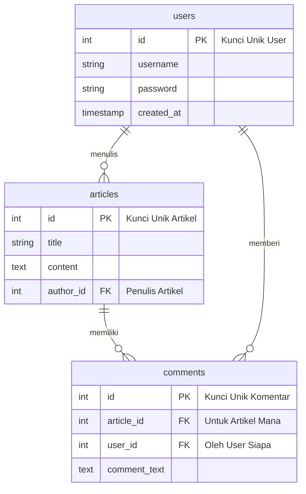

# Membedah Teori di Balik Proyek Blog Pribadi

Halo! Selamat datang di catatan teori untuk proyek "Personal Blogspot". Jika sebelumnya kita fokus pada *apa yang akan dibuat*, sekarang kita akan membahas *mengapa dan bagaimana cara kerjanya* dari sisi teori.

Catatan ini bertujuan agar kamu tidak hanya bisa membuat, tetapi juga benar-benar **paham** konsep-konsep penting di baliknya. Mari kita mulai!

---

## 1. Review Ulang: Database Relasional Itu Apa Sih?

Bayangkan kamu punya banyak data: data pengguna, data artikel, dan data komentar. Kalau semua dicampur aduk dalam satu tempat, pasti pusing, kan?

Database relasional membantu kita merapikan data ini ke dalam "kotak-kotak" terpisah yang disebut **tabel**. Setiap tabel punya baris (data) dan kolom (informasi spesifik).

**Keajaibannya ada pada "relasi" atau hubungan antar tabel.**

> **Analogi:** Bayangkan `tabel users` adalah daftar siswa di sekolah, dan `tabel articles` adalah daftar semua esai yang pernah mereka tulis. Dengan relasi, kita bisa tahu persis esai mana ditulis oleh siswa yang mana.

### Jenis Hubungan dalam Proyek Kita

Di proyek blog ini, kita akan fokus pada dua jenis hubungan utama:

#### a. Hubungan Satu-ke-Banyak (One-to-Many / 1-M)

Ini adalah hubungan paling umum. Artinya, satu baris data di tabel A bisa berhubungan dengan banyak baris di tabel B.

**Contoh di Proyek Blog:**
1.  `users` (1) → (M) `articles`
    *   **Artinya:** **Satu** pengguna bisa menulis **banyak** artikel.
    *   **Gampangnya:** Tidak mungkin satu artikel ditulis oleh banyak pengguna (dalam model solo-blogger kita).
2.  `articles` (1) → (M) `comments`
    *   **Artinya:** **Satu** artikel bisa memiliki **banyak** komentar.
3.  `users` (1) → (M) `comments`
    *   **Artinya:** **Satu** pengguna bisa memberikan **banyak** komentar (baik di artikelnya sendiri maupun artikel orang lain).

#### b. Hubungan Banyak-ke-Banyak (Many-to-Many / M-N) - *Untuk Nanti*

Ini sedikit lebih kompleks. Satu data di tabel A bisa berhubungan dengan banyak data di tabel B, dan sebaliknya.

**Contoh:** Satu artikel bisa punya banyak **tag** (misal: #PHP, #Web, #Tips), dan satu tag bisa digunakan di banyak artikel. Untuk membuat ini, kita butuh tabel perantara (tabel *pivot*).

> Konsep ini akan kita dalami di proyek selanjutnya. Sekarang, fokus dulu di 1-M!

---

## 2. Teori Penting untuk Mengerjakan Proyek

Berikut adalah beberapa teori kunci yang wajib kamu pahami agar proyek ini berjalan lancar.

### a. Blueprint Database: Entity Relationship Diagram (ERD)

ERD adalah peta atau denah yang menggambarkan semua tabel dalam database kita dan bagaimana mereka saling terhubung. Sebelum membangun "rumah" (database), kita butuh "blueprint" (ERD) dulu.

Lihat diagram di bawah ini. Ini adalah ERD untuk proyek kita.


**Cara Membaca Diagram:**
*   `users ||--o{ articles` : Tanda `||` artinya "satu" dan `o{` artinya "banyak". Jadi, **satu** `users` terhubung ke **banyak** `articles`.

### b. Kunci Ajaib: Primary Key (PK) dan Foreign Key (FK)

Relasi antar tabel tidak akan bisa terjadi tanpa dua kunci ini.

*   **Primary Key (PK):**
    *   Ini adalah **penanda unik** untuk setiap baris dalam sebuah tabel. Tidak boleh ada yang sama.
    *   **Contoh:** `users.id` adalah PK untuk tabel `users`. Setiap pengguna baru akan punya `id` yang berbeda.
    *   **Analogi:** Nomor Induk Siswa (NIS) atau nomor KTP.

*   **Foreign Key (FK):**
    *   Ini adalah kolom di sebuah tabel yang "meminjam" nilai dari Primary Key tabel lain. Fungsinya untuk **menciptakan hubungan**.
    *   **Contoh:** `articles.author_id` adalah FK. Isinya adalah `id` dari tabel `users`. Dengan begitu, kita tahu siapa penulis artikel tersebut.
    *   **Analogi:** Saat meminjam buku di perpustakaan, petugas akan mencatat NIS kamu di data peminjaman buku. NIS kamu di sana menjadi "foreign key".

### c. Menjaga Data Tetap Sehat: Integritas Data & Aksi Referensial

Apa yang terjadi jika seorang pengguna menghapus akunnya? Haruskah artikel dan komentarnya tetap ada? Tentu tidak, kan?

Di sinilah **integritas data** berperan. Kita harus memastikan data kita selalu konsisten. Salah satu caranya adalah dengan aksi referensial seperti `ON DELETE CASCADE`.

```sql
-- Potongan kode dari tabel articles
FOREIGN KEY (author_id) REFERENCES users(id) ON DELETE CASCADE
```

*   `FOREIGN KEY (author_id) REFERENCES users(id)`: Menciptakan hubungan antara `articles.author_id` dan `users.id`.
*   `ON DELETE CASCADE`: Ini adalah perintah ajaibnya. Artinya, jika data di tabel `users` (induk) **dihapus**, maka semua data di tabel `articles` (anak) yang terhubung dengannya akan **ikut terhapus secara otomatis**.
    *   Ini mencegah adanya "artikel yatim piatu" (artikel tanpa penulis).

### d. Menggabungkan Informasi: Query `JOIN`

Data penulis ada di `users`. Data artikel ada di `articles`. Bagaimana cara menampilkan judul artikel **DAN** nama penulisnya sekaligus dalam satu tampilan?

Gunakan `JOIN`! Perintah ini memungkinkan kita mengambil data dari beberapa tabel yang berelasi dalam satu kali query.

```sql
SELECT
  articles.title,    -- Ambil judul dari tabel articles
  articles.content,  -- Ambil konten dari tabel articles
  users.username     -- Ambil username dari tabel users
FROM articles
INNER JOIN users ON articles.author_id = users.id;
```

*   `INNER JOIN users ON articles.author_id = users.id`: Perintah ini memberitahu MySQL, "Gabungkan `articles` dengan `users` di mana nilai `author_id` di tabel `articles` sama dengan nilai `id` di tabel `users`."

---

## 3. Link Bermanfaat untuk Belajar Lebih Lanjut

Untuk memperdalam pemahamanmu, silakan kunjungi sumber-sumber berikut. Jangan ragu bertanya jika ada yang kurang jelas!

*   **Database Relasional:**
    *   [Apa itu Database Relasional? (AWS)](https://aws.amazon.com/id/relational-database/)
    *   [Video Penjelasan Database untuk Pemula (YouTube)](https://www.youtube.com/watch?v=A_Oia2DRj38)
*   **SQL JOIN:**
    *   [Visualisasi SQL JOINs (W3Schools)](https://www.w3schools.com/sql/sql_join.asp)
    *   [Tutorial Interaktif SQL (SQLBolt)](https://sqlbolt.com/lesson/select_queries_with_joins)
*   **PHP & MySQL:**
    *   [Menghubungkan PHP ke MySQL dengan PDO (PHP Manual)](https://www.php.net/manual/en/pdo.connections.php)
    *   [Playlist Tutorial PHP untuk Pemula (Web Programming UNPAS)](https://www.youtube.com/playlist?list=PLFIM0718LjIUvTso61VwTvhL5i3A22J1T)

---

> **Pesan Semangat:**
> Teori mungkin terlihat membosankan, tapi memahaminya akan memberimu kekuatan super untuk membangun aplikasi yang lebih baik, lebih kuat, dan lebih mudah dikelola. Teruslah berlatih!