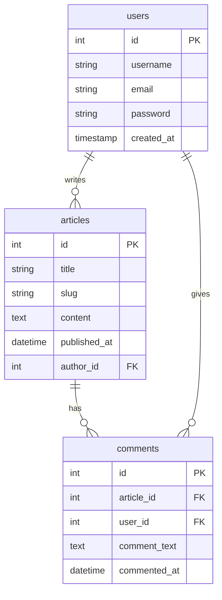

**Materi:** Pendalaman Desain Database Relasional dengan MySQL  
**Tema:** Web Blog Solo-Blogger  

Desain: [[Sketsa Kasar Projek Personal Blogspot.excalidraw]]

---

## 1. Pendahuluan  
Materi ini merupakan lanjutan topik _Desain Database Relasional_ yang mencakup:  
- Jenis-jenis relasi (1-1, 1-M, M-N)  
- Integritas data & aksi referensial (ON DELETE, ON UPDATE)  
- Query `JOIN`  
- Entity Relationship Diagram (ERD)  

Pembelajaran diarahkan agar siswa tidak hanya memahami teori, tetapi juga menerapkannya langsung melalui proyek web blog nyata.

---

## 2. Tema & Tujuan Proyek  
**Tema Proyek:** Personal Blog (Web Blogspot)  
**Tujuan Pembelajaran:**  
1. Siswa mampu membangun website yang menarik dan responsif.  
2. Siswa memahami penerapan konsep-konsep database relasional:  
   - Relasi antar tabel  
   - Integritas data  
   - Aksi referensial  
   - Query `JOIN`  
   - ERD  
3. Siswa terbiasa dengan pengembangan berbasis proyek (PHP + MySQL).

---

## 3. Teknologi yang Digunakan  
- Backend: PHP (v8.1+) tanpa framework  
- Database: MySQL (v8.0+)  
- Frontend: HTML, CSS, JavaScript  
- UI Library (opsional): Bootstrap 5 (direkomendasikan)  
- Version Control (opsional): Git  

---

## 4. Aktor & Peran
- **User (Penulis):** menulis, mengedit, menghapus artikel; memberi komentar.  
- **Guest (Tamu):** membaca artikel; harus register/login untuk memberi komentar.  
- **Admin (opsional):** pengajar/pengelola sistem; memiliki hak penuh.  

> Catatan: Untuk fase awal (kelas XI) sistem menggunakan **solo blogger** (satu penulis utama).

---

## 5. Fitur Utama Aplikasi  
### a. Fitur Umum  
- Registrasi & login  
- Logout  
- Melihat daftar artikel (feed)  
### b. Fitur Penulis (User)  
- Dashboard pribadi
- CRUD artikel (Create, Read, Update, Delete)  
- Melihat komentar pada artikelnya  
- Memberi komentar ke artikel lain  
### c. Fitur Guest  (Tamu)
- Melihat artikel tanpa login  
- Login/register untuk memberi komentar  

> **Catatan tahap lanjutan (opsional):** fitur “like” untuk artikel, dan mode komunitas (feed terpusat).

---

## 6. Struktur Database (Fase 1: Solo Blogger)  
Tabel utama: `users`, `articles`, `comments`  
Relasi:  
- users (1) → (M) articles  
- articles (1) → (M) comments  
- users (1) → (M) comments  

### 6.1 Skema MySQL  
```sql
CREATE TABLE users (
  id INT AUTO_INCREMENT PRIMARY KEY,
  username VARCHAR(50) NOT NULL UNIQUE,
  password VARCHAR(255) NOT NULL,
  created_at TIMESTAMP DEFAULT CURRENT_TIMESTAMP
);

CREATE TABLE articles (
  id INT AUTO_INCREMENT PRIMARY KEY,
  title VARCHAR(200) NOT NULL,
  slug VARCHAR(200) NOT NULL UNIQUE,
  content TEXT NOT NULL,
  published_at DATETIME DEFAULT CURRENT_TIMESTAMP,
  author_id INT NOT NULL,
  FOREIGN KEY (author_id) REFERENCES users(id) ON DELETE CASCADE
);

CREATE TABLE comments (
  id INT AUTO_INCREMENT PRIMARY KEY,
  article_id INT NOT NULL,
  user_id INT NOT NULL,
  comment_text TEXT NOT NULL,
  commented_at DATETIME DEFAULT CURRENT_TIMESTAMP,
  FOREIGN KEY (article_id) REFERENCES articles(id) ON DELETE CASCADE,
  FOREIGN KEY (user_id) REFERENCES users(id) ON DELETE CASCADE
);
````

### 6.2 ERD



---

## 7. Struktur Proyek

```
/blogspot/
│
├── admin/             ← panel pengelolaan postingan (admin/penulis)
│   ├── index.php
│   ├── new.php
│   ├── edit.php
│   ├── delete.php
│
├── includes/          ← file umum (konfigurasi, fungsi, template)
│   ├── config.php
│
├── public/            ← aset front-end
│   ├── css/
│   ├── js/
│   └── images/
│
├── index.php           ← halaman utama / feed artikel
├── post.php            ← detail artikel (/posts/{username}/{slug})
├── login.php           ← halaman login
├── logout.php           ← halaman (route) untuk logout
```

---

## 8. Routing & Navigasi Dasar

| Route                        | Deskripsi                                              |
| ---------------------------- | ------------------------------------------------------ |
| `/`                          | Beranda / feed utama (menampilkan semua artikel)       |
| `/posts?s={slug}&a={author}` | Halaman detail artikel berdasarkan `username` & `slug` |
| `/login`                     | Halaman autentikasi (login / masuk)                    |
| `/register`                  | Halaman autentikasi (registrasi  / daftar)             |
| `/admin/index.php`           | Halaman Dashboard penulis (untuk mengelola postingan)  |
| `/admin/new`                 | Form tambah artikel baru (hanya untuk penulis)         |
| `/admin/edit?id={id}`        | Edit artikel (by ID)                                   |
| `/admin/delete?id={id}`      | Hapus artikel (by ID)                                  |

---

## 9. Langkah-Langkah Pengembangan

1. Desain **ERD** & buat database di MySQL
2. Desain antarmuka (UI/UX) menggunakan HTML & CSS / Bootstrap
3. Setup lingkungan pengembangan (local server, PHP, MySQL, Git)
4. Hubungkan website dengan database
5. Buat halaman login & register
6. Buat halaman utama (feed artikel)
7. Buat dashboard user & CRUD artikel
8. Tambahkan fitur komentar
9. Uji konsep integritas data & query `JOIN`
10. (Opsional) Implementasikan fitur “like” atau “tag” untuk relasi many-to-many

---

## 10. Catatan untuk Guru / Pengajar

- Fase 2 dan Fase 3 (fitur “like” dan mode komunitas) bersifat **opsional lanjutan** dan dapat digunakan untuk memperdalam konsep basis data.
- Untuk kelas XI, cukup fokus hingga fase solo blogger dengan komentar agar siswa memahami dasar relasi dan integritas data.
- Disarankan guru menyediakan **template proyek dasar** (struktur folder + file kosong) agar siswa bisa fokus pada database dan logika CRUD tanpa terbebani setup awal.

---

## Lampiran/Referensi
Visualisasi ERD (Mermaid) telah disertakan di bagian [[#6.2 ERD (Mermaid)]]
Materi tambahan:
- Relasi many-to-many (tags, likes)
- Integritas referensial (ON DELETE, ON UPDATE)
- Praktik `JOIN` (inner, left, right)
- Teknik pengamanan slug dan URL SEO friendly

---

## Akhir Kata

Semoga proyek ini memberi pengalaman belajar yang menyenangkan sekaligus bermakna bagi siswa dalam memahami konsep database relasional dan pengembangan web full stack sederhana.

> “Belajar dengan praktik nyata membuat konsep jadi lebih mudah dipahami, dan proyek ini adalah jembatan antara teori dan aplikasi.”
