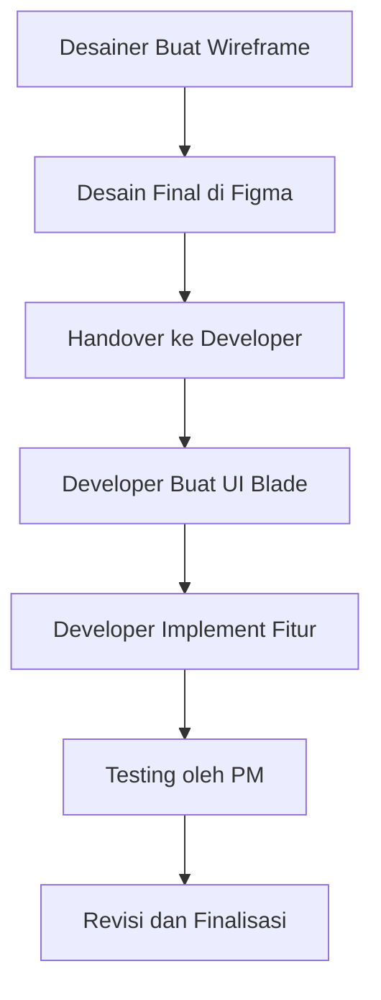

# Project Photobox  
Self Photoshoot App

---

# Apa Itu Photobox?

- Aplikasi foto mandiri  
- Ambil beberapa foto  
- Susun ke layout siap cetak  
- Hasil berkualitas tinggi  

---

# Peran Tim

---
## Desainer (DKV)
- Membuat UI/UX di Figma  
- Menyediakan aset (logo, ikon, watermark)  

---
## Developer (RPL)
- Menerjemahkan desain ke kode  
- Fitur kamera, capture, layout A4  

---
## PM
- Mengarahkan  
- Review desain & kode  
- Testing

---

# Alur Kerja Tim

---

# Roadmap

- Minggu 1: Wireframe + Setup Project
- Minggu 2: Desain Final + Implementasi UI
- Minggu 3: Kamera + Capture + Layout
- Minggu 4: Testing + Finalisasi

---

# Hal yang Masih Perlu Ditambahkan

- Filter kamera
- UI sesuai desain DKV
- Perbaikan layout A4

---

# Tujuan Utama

- Aplikasi siap pakai untuk event
- Kolaborasi antar jurusan    
- Portofolio nyata bagi siswa

---

# Prototype Saat Ini

- Kamera dan resolusi  
- Countdown  
- Ambil 4 foto  
- Layout A4  
- Download hasil  

Belum ada: filter kamera, UI final

[preview](file:///home/japar/data/web/simple-photoshoot/index.html)

---

# Diskusi

Apa yang ingin kalian tanyakan atau tambahkan?